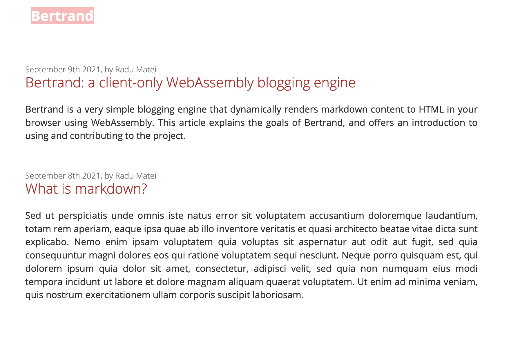

# Bertrand

_A simple WebAssembly blogging engine_

Bertrand is a very simple dynamic site generator that renders markdown into HTML
web pages directly in the browser using WebAssembly. It uses
[Yew](https://yew.rs/) as the framework for building a single page application,
[Handlebars](https://handlebarsjs.com/) and
[Rhai](https://github.com/rhaiscript/rhai) for templating and scripting, and
[`pulldown-cmark`](https://crates.io/crates/pulldown-cmark) for rendering
markdown.

[Read an introduction about Bertrand here](./example/content/introducing-bertrand.md).



### Warning

This project is still a work in progress, and highly unstable. The authors do
not currently recommend using it for anything other than experimentation.

### Building and using

The `example/` directory contains a working example of a simple website
dynamically rendered using Bertrand. The directory structure is representative
of the current content structure for your website.

To run the example:

```
➜ npm install
➜ npm run optimized
```

Navigate in the browser to `http://localhost:8080/introducing-bertrand` to read
an introduction about Bertrand.

### Acknowledgements

This project is using and is inspired by a lot of awesome open source projects:

- [Yew](https://yew.rs/)
- [Handlebars](https://handlebarsjs.com/)
- [Rhai](https://github.com/rhaiscript/rhai)
- [`pulldown-cmark`](https://crates.io/crates/pulldown-cmark)

- [Bartholomew](https://github.com/technosophos/bartholomew) -- this project is
  heavily inspired (and borrows quite a bit of the structure and libraries) by
  Bartholomew, a _micro-CMS for WebAssembly and Wagi_,
